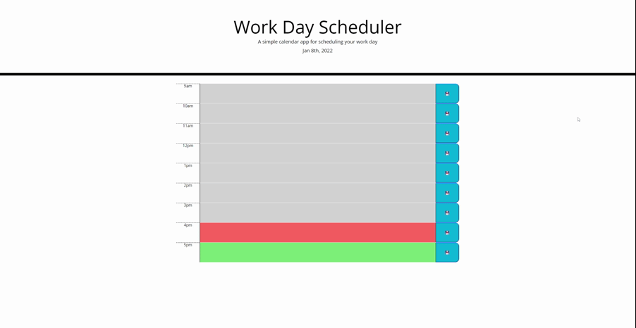

# Work Day Scheduler 

---

## Table of Contents 

- [Description](#description)
- [Functionality](#functionality)
- [Deployed Application](#deployed-application)
- [Technologies](#technologies)
- [Credits](#credits)

---

## Description

This application is a work day scheduling tool. This allows you to save tasks and events to each time block of a standard work day using the local storage of your machine. 

This project was built to help me with the following:

  * local storage, both saving information to, and recalling information from
  * understand and use jQuery to dynamically update HTML and CSS
  * understanding and using the moment.js library

## Functionality

The following video demonstrates the application's functionality:

## Credits

#### Alex Miramontes - Jr. Web Developer
[GitHub](https://github.com/amiramonte)
